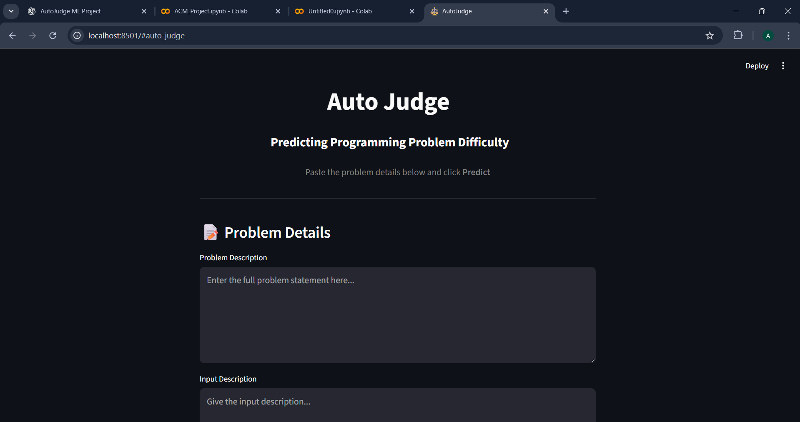
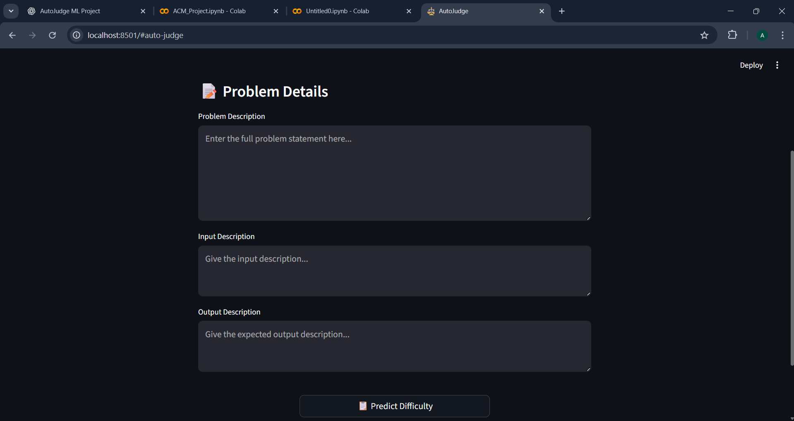
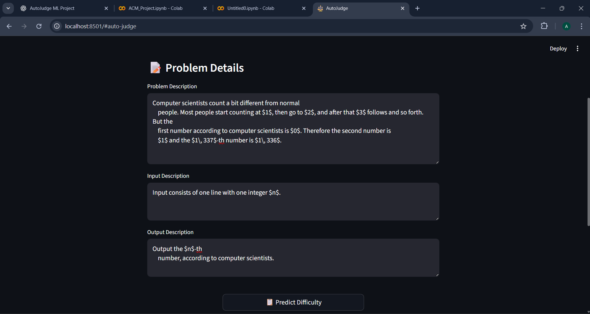
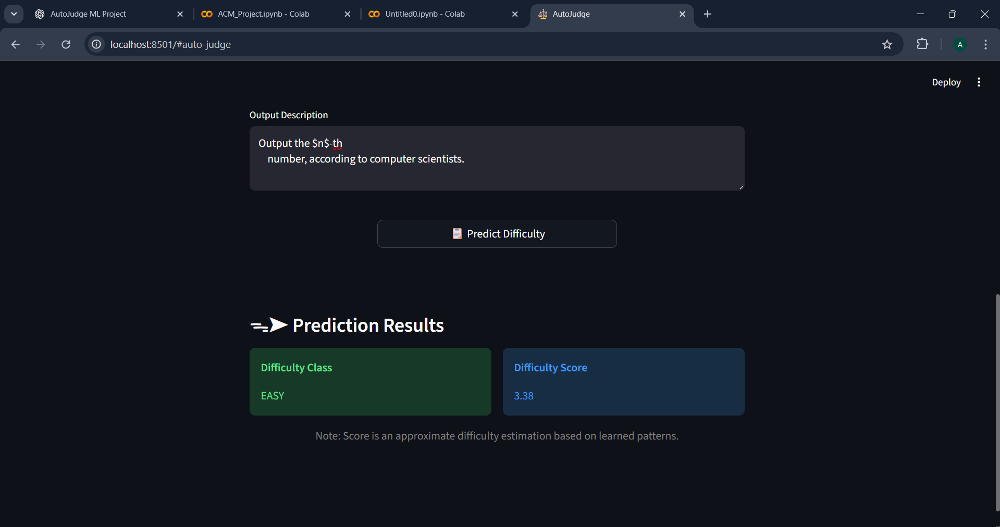

# Auto Judge  
### Predicting Programming Problem Difficulty

Auto Judge is a machine learning–based system that automatically predicts the **difficulty level** and **difficulty score** of programming problems using only their textual descriptions.

Online coding platforms such as Codeforces, CodeChef, and Kattis usually rely on human judgment and user feedback to label problems as *Easy*, *Medium*, or *Hard*.  
This project demonstrates how **Natural Language Processing (NLP)** and **machine learning** can be used to automate this process.

---

## 📖 Project Objectives

The system predicts:

- **Problem Class** → Easy / Medium / Hard *(Classification)*
- **Problem Score** → Numerical difficulty value *(Regression)*

Predictions are based **only on text**, including:
- Problem description
- Input description
- Output description

No metadata, user submissions, or solution code is used.

---

## 📑 Dataset

Each data sample contains:
- `title`
- `description`
- `input_description`
- `output_description`
- `problem_class` (Easy / Medium / Hard)
- `problem_score` (numerical)

The provided dataset is used and **no manual labeling is required**.

---

## 📜 Approach

### 1. Data Preprocessing
- Combined description, input, and output into a single text field
- Cleaned text by removing HTML, URLs, and extra whitespace
- Converted text to lowercase

### 2. Feature Engineering
**Text Features**
- TF-IDF vectors (unigrams + bigrams, max 30,000 features)

**Handcrafted Numeric Features**
- Log-transformed text length
- Log-transformed count of mathematical symbols
- Constraint indicators (constraints, large N, time limits)
- Keyword frequency for algorithm categories:
  - Dynamic Programming
  - Graph Algorithms
  - Data Structures
  - Math
  - Geometry
  - Strings
  - Greedy Techniques

TF-IDF features and numeric features are concatenated to form the final input.

---

## 🗃️ Models Used

### Classification
- Logistic Regression *(final model)*
- Tried: Random Forest, SVM

### Regression
- Gradient Boosting Regressor *(final model)*
- Tried: Linear Regression, Random Forest

Deep learning was **not used**, as per project guidelines.

---

## 📓 Evaluation Results

### Classification (Logistic Regression)
- **Test Accuracy:** ~54%
- Hard problems were predicted most reliably
- Medium problems were hardest to classify due to overlap

### Regression (Gradient Boosting)
- **Test RMSE:** ~2.01  
- **Test MAE:** ~1.68  

> Note: Gradient Boosting smooths predictions by averaging multiple weak learners, so exact score matching is not expected. Small deviations are normal in NLP-based regression tasks.

---

## ▶️ Steps to Run the Project Locally

### Step 1: Clone the Repository

```bash
git clone https://github.com/Awani-Soni/AutoJudge-Predicting-Programming-Problem-Difficulty-
```

---

### Step 2: Install Required Dependencies

Make sure Python (3.8+) is installed.

```bash
pip install streamlit scikit-learn pandas numpy scipy joblib
```
---

### Step 3: (Optional) Reproduce Model Training

If you want to retrain the models from scratch:

- Open AutoJudge_Model.ipynb
- Update base path according to your system like:
```bash
BASE_PATH = "/content/drive/MyDrive/ACM_Project"
```

- Run all cells sequentially
- Trained models will be saved inside the {BASE_PATH}/ directory

> Note: Changing paths is necessary because absolute paths depend on the local system.

---

### Step 4: Run the Streamlit Web Application

- Open streamlit_app.py
- Update model paths to match your local directory structure, for example:

```bash
best_lr = joblib.load(r"{BASE_PATH}\logreg_classifier.pkl")
gb_final = joblib.load(r"{BASE_PATH}\gb_regressor.pkl")
tfidf = joblib.load(r"{BASE_PATH}\tfidf.pkl")
le = joblib.load(r"{BASE_PATH}\label_encoder.pkl")
```

- Run the app:

```bash
streamlit run streamlit_app.py
```
---

### Step 5: Use the Application

- Paste problem description, input description, and output description
- Click Predict
- View predicted:
  - Difficulty Class (Easy / Medium / Hard)
  - Difficulty Score


---
## 🌐 Web Interface (Streamlit)

The web interface is built using Streamlit and provides a simple user workflow:

1. Three text boxes allow users to paste:
   - Problem description
   - Input description
   - Output description
2. On clicking the **Predict** button:
   - The text is preprocessed
   - TF-IDF and handcrafted features are generated
   - The trained classification and regression models are used
4. The app displays:
   - Predicted difficulty class
   - Predicted numerical difficulty score

The interface runs locally, and no deployment or database is required.

---

## 🖼️ Web Interface Screenshots







---

## 📃 Project Structure

- **AutoJudge.ipynb**  
  Model training, feature engineering, evaluation, and saving trained models (Colab)

- **streamlit_app.py**  
  Streamlit web application for predicting problem difficulty

- **models/**  
  - `tfidf.pkl` – TF-IDF vectorizer  
  - `logreg_classifier.pkl` – Logistic Regression classification model  
  - `gb_regressor.pkl` – Gradient Boosting regression model  
  - `label_encoder.pkl` – Label encoder for difficulty classes  

- **sample_web_interface_images/**  
  Screenshots of the Streamlit web interface

- **data.jsonl**  
  Dataset used for training and evaluation

- **README.md**  
  Project documentation and usage details

---

## Author

**Awani Soni (23322008)** 
BS-MS Economics, IIT Roorkee
